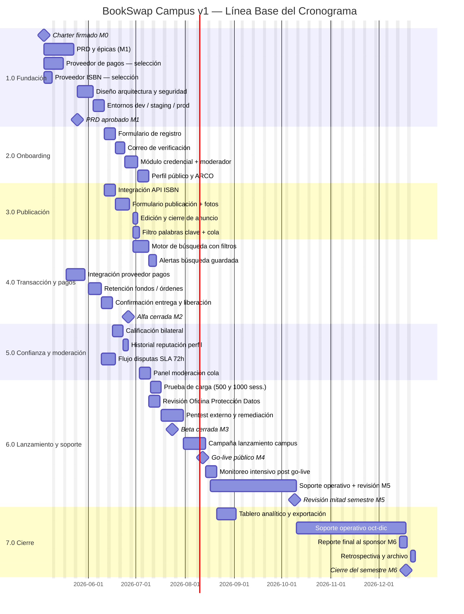

<!-- Generated by agentic-pm-kit:schedule-gantt on 2026-04-21 -->
<!-- Languages: communication=español, output=español -->
<!-- Source mode: offline -->

# Línea Base del Cronograma — BookSwap Campus v1

---

## Resumen del cronograma

| Campo | Valor |
|---|---|
| Nombre del proyecto | BookSwap Campus — Marketplace universitario de libros de texto usados (v1) |
| Autora | Mtra. Regina Ortiz Fuentes, PMO de Innovación Educativa |
| Versión | 1.0 |
| Fecha de producción | 2026-04-21 |
| Fecha de línea base | 2026-05-04 |
| Inicio planificado | 2026-05-04 |
| Fin planificado | 2026-12-18 |
| Duración total | ~32 semanas / ~160 días hábiles |
| Longitud de ruta crítica | ~160 días hábiles |

### Hitos clave

| Hito | Fecha objetivo |
|---|---|
| M0 — Charter firmado e inicio formal | 2026-05-04 |
| M1 — PRD y plan de sprints aprobados | 2026-05-25 |
| M2 — Alfa cerrada funcional (end-to-end en una sola universidad) | 2026-06-26 |
| M3 — Beta cerrada en tres universidades (gate de seguridad y privacidad) | 2026-07-24 |
| M4 — Go-live público para el ciclo de otoño 2026 | 2026-08-12 |
| M5 — Revisión de mitad de semestre | 2026-10-09 |
| M6 — Cierre del semestre y reporte de resultados | 2026-12-18 |

---

## Diagrama Gantt

---

## Detalle de tareas

| ID tarea | Nombre de la tarea | Inicio | Fin | Duración | Responsable | Dependencias |
|---|---|---|---|---|---|---|
| t112 | PRD, épicas e historias aprobadas | 2026-05-04 | 2026-05-25 | 15d | Product Owner | Ninguna (M0 = inicio) |
| t113 | Selección y contrato del proveedor de pagos | 2026-05-04 | 2026-05-18 | 10d | Product Owner / Ing. | Ninguna |
| t114 | Selección de proveedor de metadatos ISBN | 2026-05-04 | 2026-05-12 | 5d | Líder de Ingeniería | Ninguna |
| t121 | Diseño de arquitectura técnica y revisión de seguridad | 2026-05-26 | 2026-06-04 | 8d | Líder de Ingeniería | after t112 |
| t122 | Configuración de entornos dev, staging y producción | 2026-06-05 | 2026-06-11 | 5d | Líder de Ingeniería | after t121 |
| t211 | Formulario de registro y validación de dominio | 2026-06-12 | 2026-06-18 | 5d | Ingeniería + Diseño | after t122 |
| t212 | Flujo de correo de verificación (enlace de un solo uso) | 2026-06-19 | 2026-06-24 | 4d | Ingeniería | after t211 |
| t221 | Módulo de carga de credencial y revisión de moderador | 2026-06-25 | 2026-07-02 | 6d | Ingeniería + Moderación | after t212 |
| t222 | Perfil público y mecanismo ARCO (LFPDPPP) | 2026-07-03 | 2026-07-09 | 5d | Ingeniería + DTI | after t221 |
| t311 | Integración con API de metadatos ISBN | 2026-06-12 | 2026-06-18 | 5d | Ingeniería | after t122, t114 |
| t312 | Formulario de publicación con carga de fotografías | 2026-06-19 | 2026-06-29 | 7d | Ingeniería + Diseño | after t311 |
| t313 | Edición y cierre manual de anuncios | 2026-06-30 | 2026-07-02 | 3d | Ingeniería | after t312 |
| t321 | Filtro de palabras clave y cola de revisión manual | 2026-06-30 | 2026-07-03 | 4d | Ingeniería + Moderación | after t312 |
| t411 | Motor de búsqueda con filtros | 2026-06-30 | 2026-07-10 | 8d | Ingeniería | after t312 |
| t412 | Alertas de búsqueda guardada por correo | 2026-07-13 | 2026-07-16 | 3d | Ingeniería | after t411 |
| t421 | Integración con proveedor de pagos (tarjeta y SPEI) | 2026-05-19 | 2026-06-01 | 10d | Ingeniería | after t113 |
| t422 | Retención de fondos y gestión de órdenes en tránsito | 2026-06-02 | 2026-06-11 | 6d | Ingeniería | after t421 |
| t423 | Confirmación de entrega presencial y liberación de fondos | 2026-06-12 | 2026-06-19 | 5d | Ingeniería | after t422 |
| t511 | Flujo de calificación bilateral post-transacción | 2026-06-22 | 2026-06-29 | 5d | Ingeniería + Diseño | after t423 |
| t512 | Visualización de historial de reputación en perfil | 2026-06-30 | 2026-07-02 | 3d | Ingeniería + Diseño | after t511 |
| t521 | Flujo de apertura y gestión de disputas (SLA 72 h) | 2026-06-12 | 2026-06-22 | 7d | Ingeniería + Moderación | after t422 |
| t522 | Panel de moderación y cola de tareas priorizadas | 2026-06-23 | 2026-06-30 | 5d | Ingeniería + Moderación | after t521, t321 |
| t611 | Prueba de carga (500 y 1,000 sesiones, P95 < 2 s) | 2026-07-01 | 2026-07-07 | 5d | Ingeniería | after t522 |
| t613 | Revisión arquitectura — Oficina de Protección de Datos | 2026-07-10 | 2026-07-16 | 5d | DTI / Oficina de Datos | after t222 |
| t612 | Pentest externo y ciclo de remediación | 2026-07-08 | 2026-07-21 | 10d | Ingeniería / Externo | after t611 |
| t621 | Campaña de lanzamiento en campus (2 semanas pre go-live) | 2026-07-29 | 2026-08-11 | 10d | Marketing / PMO-IE | after t612 |
| t622 | Go-live público y monitoreo intensivo | 2026-08-12 | 2026-08-18 | 5d | Ingeniería + PMO-IE | after t621 |
| t623 | Soporte operativo y revisión de mitad de semestre | 2026-08-19 | 2026-10-09 | 40d | Ingeniería + Moderación | after t622 |
| t711 | Tablero analítico en tiempo real y exportación de métricas | 2026-08-19 | 2026-08-28 | 8d | Ingeniería | after t622 |
| t623b | Soporte operativo oct–dic (post M5) | 2026-10-12 | 2026-12-11 | 50d | Ingeniería + Moderación | after t623 |
| t712 | Reporte final al sponsor y Rectoría | 2026-12-14 | 2026-12-18 | 5d | PMO-IE | after t623b |
| t713 | Retrospectiva del proyecto y archivo de documentación | 2026-12-15 | 2026-12-18 | 3d | PMO-IE | after t712 |

---

## Narrativa de ruta crítica

La ruta crítica tiene una longitud de aproximadamente **160 días hábiles** (2026-05-04 → 2026-12-18) y corre a través de las siguientes tareas encadenadas:

**M0 → t112 → t121 → t122 → t311 → t312 → t321 → t522 → t611 → t612 → t621 → t622 → t623 → t623b → t712 → M6**

La duración acumulada de las tareas en esta cadena es de aproximadamente 160 días hábiles (2026-05-04 → 2026-12-18). Cada tarea tiene float cero dentro de este camino; cualquier demora se traslada directamente a la fecha de cierre M6.

- **t112 — PRD y épicas aprobadas (15d):** Primer entregable de gestión. Todo el desarrollo depende de que el alcance esté firmado; cualquier demora aquí retrasa la arquitectura (t121) y el arranque del desarrollo.
- **t121 — Diseño de arquitectura técnica (8d):** Determina las decisiones de plataforma y escalado que impactan directamente el resultado de la prueba de carga (t611). Su aprobación desbloquea t122 y el inicio de los módulos.
- **t122 — Configuración de entornos (5d):** Ningún desarrollo de módulos puede comenzar sin los entornos listos; es un cuello de botella que habilita en paralelo los módulos de onboarding (t211) y publicación (t311).
- **t311 → t312 → t321 — Publicación y moderación automática (5+7+4=16d):** La cadena de publicación es la rama más larga que converge en t522 (panel de moderación). t321 finaliza más tarde que t521 (disputas), por lo que es la restricción vinculante para t522.
- **t522 — Panel de moderación (5d):** Nodo de convergencia entre la rama de publicación (t321) y la rama de disputas (t521). Su finalización desbloquea la prueba de carga.
- **t611 — Prueba de carga (5d):** Gate de calidad irreversible antes de M3. Si el P95 falla el criterio de 2 s, se requiere remediación de arquitectura antes de continuar con t612.
- **t612 — Pentest externo y remediación (10d):** Gate de seguridad antes del go-live. Los hallazgos críticos o altos bloquean el avance a t621.
- **t621 — Campaña de lanzamiento (10d):** La campaña debe terminar el día antes del go-live (M4, 2026-08-12). Su fecha de inicio está determinada por t612.
- **t622 → t623 → t623b (5+40+50=95d):** El periodo de soporte operativo entre M4 y M6 no tiene float; la entrega del reporte final (t712) fija el cierre del proyecto en M6.

**Ramas paralelas con float:** La cadena de pagos t113 → t421 → t422 → t521 corre en paralelo con la rama de publicación; t421 finaliza el 2026-06-01, que es anterior al fin de t321 (2026-07-03), por lo que la cadena de pagos tiene float disponible de aproximadamente 22 días hábiles y no está en la ruta crítica. Las tareas t412 (alertas de búsqueda), t512 (historial de reputación), t313 (edición de anuncio), t211/t212/t221/t222 (onboarding), t613 (Oficina de Datos) y t711 (tablero) también tienen float de 5 a 20 días hábiles cada una.

---

## Supuestos y riesgos de cronograma

### Supuestos

- Los días hábiles son lunes a viernes; los festivos del calendario oficial mexicano (incluyendo Semana Santa, 1 de mayo, 16 de septiembre, 2 de noviembre) están excluidos del cómputo de duración.
- El equipo de cuatro personas dedicadas está disponible al 100 % de su asignación durante todo el proyecto, sin licencias prolongadas (referencia: riesgo R7 de la matriz).
- El proveedor de pagos seleccionado (t113) entrega documentación técnica de integración completa dentro de los 5 días hábiles posteriores a la firma del contrato.
- Las credenciales de acceso al proveedor de metadatos ISBN (t114) están disponibles para el equipo de ingeniería antes del inicio de t311.
- Los entornos de infraestructura en la nube provistos por DTI soportan escalado horizontal automático sin configuración adicional del equipo del proyecto (referencia: riesgo R6 de la matriz).
- La Oficina de Protección de Datos confirma disponibilidad para la revisión de arquitectura (t613) dentro de la ventana 2026-07-10 a 2026-07-16.
- El proveedor de pentest externo (t612) entrega el reporte preliminar dentro de 7 días hábiles tras completar las pruebas.
- El personal estudiantil honorífico de moderación no experimenta ausencias prolongadas durante el periodo de exámenes de octubre ni de noviembre-diciembre (referencia: riesgo R12 de la matriz).

### Riesgos de cronograma

| Riesgo | Probabilidad | Impacto | Mitigación |
|---|---|---|---|
| R6 — La arquitectura no soporta el pico de tráfico de la primera semana de clases (prueba de carga t611 falla el criterio P95 < 2 s) | Media | Alto | Ejecutar dos pruebas de carga iterativas (500 y 1,000 sesiones) previas a M3; definir un plan de remediación de capacidad (escalado horizontal, caché de búsquedas) que pueda ejecutarse en ≤ 5 días antes de avanzar a t612. La ventana entre t611 y t612 incluye 3 días de buffer para remediación menor. |
| R7 — Rotación o ausencia prolongada de uno o más miembros del equipo de cuatro personas dedicadas | Media | Alto | Documentar los módulos críticos de la ruta crítica (t421, t422, t521, t522, t611) con guías de onboarding técnico de ≤ 1 día para un sustituto; mantener al menos 5 días de float en las tareas de soporte (t623) como colchón; revisar la carga del equipo en retrospectivas de sprint cada dos semanas. |
| Demora en la firma del contrato con el proveedor de pagos (t113 se extiende más allá de 10 días) | Media | Alto | La selección del proveedor de pagos inicia en M0 y corre en paralelo con t112; si la firma se retrasa más de 5 días, escalar al sponsor para autorizar inicio provisional de desarrollo con un proveedor sandbox. t421 puede arrancar en modo sandbox sin contrato definitivo. |
| Hallazgos críticos en el pentest (t612) que requieren refactorización de módulos core | Media | Alto | Incluir 5 días de buffer entre t612 y t621; si los hallazgos requieren más de 5 días de remediación, la decisión de go-live se escala al sponsor con un plan de mitigación de riesgo residual documentado. |
| Incumplimiento de SLA de primera revisión de la Oficina de Protección de Datos (t613) | Baja | Medio | Solicitar la agenda de la revisión formalmente con al menos 3 semanas de anticipación (antes del 19 de junio de 2026); identificar un revisor alterno dentro de DTI que pueda suplir la disponibilidad. |

---

## Fuente consultada

**Referencia canónica:** https://en.wikipedia.org/wiki/Gantt_chart
**Modo:** offline
**Nota:** Se utilizó conocimiento general de las convenciones del diagrama de Gantt y de los principios de gestión del cronograma del Project Management Institute, incluyendo identificación de la ruta crítica (cadena de tareas con float cero), representación de dependencias con la notación `after <id>` de Mermaid, y diseño de hitos de control. No se fabricaron citas textuales ni números de página. La URL canónica queda para consulta directa del lector cuando el modo en línea esté habilitado.
