<!-- Generated by agentic-pm-kit:wbs on 2026-04-21 -->
<!-- Languages: communication=español, output=español -->
<!-- Source mode: offline -->

# Estructura de Desglose del Trabajo (EDT)

## Metadata

| Campo | Valor |
|---|---|
| Nombre del proyecto | BookSwap Campus — Marketplace universitario de libros de texto usados (v1) |
| Autora | Mtra. Regina Ortiz Fuentes, PMO de Innovación Educativa |
| Versión | 1.0 |
| Fecha | 2026-04-21 |
| Artefacto fuente | `docs/pm-kit/outputs/epics-and-stories/bookswap-campus-v1.md` |

---

## Resumen del proyecto

BookSwap Campus v1 es un marketplace web peer-to-peer para la compraventa de libros de texto usados entre estudiantes de tres universidades piloto de la Ciudad de México. La EDT cubre siete fases de entrega orientadas a entregables: fundación del proyecto, plataforma de onboarding, plataforma de publicación, plataforma de transacción y pagos, plataforma de confianza y moderación, lanzamiento y soporte operativo, y cierre formal del proyecto. Las fases 2 a 5 constituyen el núcleo de desarrollo y representan la mayor concentración de esfuerzo; la fecha fija de go-live (M4, 2026-08-12) determina la ruta crítica. El equipo cuenta con cuatro personas dedicadas más colaboradores estudiantiles honoríficos.

---

## Desglose del trabajo

- **1.0 Fundación del proyecto**
  - 1.1 Gestión y planificación inicial
    - 1.1.1 Charter firmado e inicio formal (M0)
    - 1.1.2 PRD, épicas e historias aprobadas (M1)
    - 1.1.3 Selección y contrato del proveedor de pagos
    - 1.1.4 Selección de proveedor de metadatos ISBN
  - 1.2 Arquitectura y configuración de entorno
    - 1.2.1 Diseño de arquitectura técnica y revisión de seguridad
    - 1.2.2 Configuración del entorno de desarrollo, staging y producción

- **2.0 Plataforma — Onboarding y verificación**
  - 2.1 Registro y verificación por correo institucional
    - 2.1.1 Formulario de registro y validación de dominio
    - 2.1.2 Flujo de correo de verificación (enlace de un solo uso)
  - 2.2 Credencial estudiantil y perfil público
    - 2.2.1 Módulo de carga de credencial y revisión de moderador
    - 2.2.2 Perfil público y gestión de datos personales (ARCO)

- **3.0 Plataforma — Publicación de anuncios**
  - 3.1 Creación y edición de anuncios
    - 3.1.1 Integración con API de metadatos ISBN (autocompletado)
    - 3.1.2 Formulario de publicación con carga de fotografías
    - 3.1.3 Edición y cierre manual de anuncios
  - 3.2 Moderación automática de contenido
    - 3.2.1 Filtro de palabras clave y cola de revisión manual

- **4.0 Plataforma — Transacción y pagos**
  - 4.1 Búsqueda y descubrimiento
    - 4.1.1 Motor de búsqueda con filtros (universidad, curso, semestre, ISBN)
    - 4.1.2 Alertas de búsqueda guardada por correo
  - 4.2 Flujo de compra y pagos
    - 4.2.1 Integración con proveedor de pagos (tarjeta y SPEI)
    - 4.2.2 Retención de fondos y gestión de órdenes en tránsito
    - 4.2.3 Confirmación de entrega y liberación de fondos

- **5.0 Plataforma — Confianza y moderación**
  - 5.1 Reputación y calificación
    - 5.1.1 Flujo de calificación bilateral post-transacción
    - 5.1.2 Visualización de historial de reputación en perfil público
  - 5.2 Disputas y moderación
    - 5.2.1 Flujo de apertura y gestión de disputas (SLA 72 h)
    - 5.2.2 Panel de moderación y cola de tareas

- **6.0 Lanzamiento y soporte**
  - 6.1 Calidad y seguridad
    - 6.1.1 Prueba de carga (500 y 1,000 sesiones concurrentes)
    - 6.1.2 Pentest externo y remediación
    - 6.1.3 Revisión de arquitectura por Oficina de Protección de Datos
  - 6.2 Go-live y operación inicial
    - 6.2.1 Campaña de lanzamiento en campus (pre go-live)
    - 6.2.2 Go-live público y monitoreo intensivo (M4)
    - 6.2.3 Soporte operativo y revisión de mitad de semestre (M5)

- **7.0 Cierre**
  - 7.1 Reporte y documentación final
    - 7.1.1 Tablero analítico y exportación de métricas para reporte
    - 7.1.2 Reporte final al sponsor y Rectoría (M6)
    - 7.1.3 Retrospectiva y archivo del proyecto

---

## Visualización Mermaid

```mermaid
graph TD
    A[1.0 Fundación del proyecto] --> B[1.1 Gestión y planificación inicial]
    A --> C[1.2 Arquitectura y entorno]
    B --> B1[1.1.1 Charter M0]
    B --> B2[1.1.2 PRD y épicas M1]
    B --> B3[1.1.3 Proveedor de pagos]
    C --> C1[1.2.1 Diseño arquitectura]
    C --> C2[1.2.2 Entornos dev/staging/prod]

    D[2.0 Onboarding y verificación] --> E[2.1 Registro e-mail]
    D --> F[2.2 Credencial y perfil]
    E --> E1[2.1.1 Formulario registro]
    E --> E2[2.1.2 Correo verificación]
    F --> F1[2.2.1 Módulo credencial]
    F --> F2[2.2.2 Perfil y ARCO]

    G[3.0 Publicación de anuncios] --> H[3.1 Creación y edición]
    G --> I[3.2 Moderación automática]
    H --> H1[3.1.1 API ISBN]
    H --> H2[3.1.2 Formulario + fotos]
    I --> I1[3.2.1 Filtro palabras clave]

    J[4.0 Transacción y pagos] --> K[4.1 Búsqueda]
    J --> L[4.2 Flujo de compra]
    K --> K1[4.1.1 Motor de búsqueda]
    L --> L1[4.2.1 Integración pagos]
    L --> L2[4.2.2 Retención de fondos]
    L --> L3[4.2.3 Liberación de fondos]

    M[5.0 Confianza y moderación] --> N[5.1 Reputación]
    M --> O[5.2 Disputas]
    N --> N1[5.1.1 Calificación bilateral]
    O --> O1[5.2.1 Flujo disputas]
    O --> O2[5.2.2 Panel moderación]

    P[6.0 Lanzamiento y soporte] --> Q[6.1 Calidad y seguridad]
    P --> R[6.2 Go-live]
    Q --> Q1[6.1.1 Prueba de carga]
    Q --> Q2[6.1.2 Pentest]
    R --> R1[6.2.1 Campaña lanzamiento]
    R --> R2[6.2.2 Go-live M4]

    S[7.0 Cierre] --> T[7.1 Reporte y documentación]
    T --> T1[7.1.1 Tablero y exportación]
    T --> T2[7.1.2 Reporte final M6]
    T --> T3[7.1.3 Retrospectiva]
```

---

## Detalle de paquetes de trabajo

| Código EDT | Entregable | Responsable | Duración (días) | Dependencias |
|---|---|---|---|---|
| 1.1.1 | Charter firmado e inicio formal (M0) | PMO-IE / Sponsor | 0 (hito) | Ninguna |
| 1.1.2 | PRD, épicas e historias aprobadas (M1) | Product Owner | 15 | 1.1.1 |
| 1.1.3 | Selección y contrato del proveedor de pagos | Product Owner / Líder de Ingeniería | 10 | 1.1.1 |
| 1.1.4 | Selección de proveedor de metadatos ISBN | Líder de Ingeniería | 5 | 1.1.1 |
| 1.2.1 | Diseño de arquitectura técnica y revisión de seguridad | Líder de Ingeniería | 8 | 1.1.2 |
| 1.2.2 | Configuración de entornos dev, staging y producción | Líder de Ingeniería | 5 | 1.2.1 |
| 2.1.1 | Formulario de registro y validación de dominio institucional | Ingeniería + Diseño | 5 | 1.2.2 |
| 2.1.2 | Flujo de correo de verificación con enlace de un solo uso | Ingeniería | 4 | 2.1.1 |
| 2.2.1 | Módulo de carga de credencial y revisión de moderador | Ingeniería + Moderación | 6 | 2.1.2 |
| 2.2.2 | Perfil público y mecanismo ARCO (LFPDPPP) | Ingeniería + DTI | 5 | 2.2.1 |
| 3.1.1 | Integración con API de metadatos ISBN (autocompletado) | Ingeniería | 5 | 1.1.4, 1.2.2 |
| 3.1.2 | Formulario de publicación con carga de fotografías | Ingeniería + Diseño | 7 | 3.1.1 |
| 3.1.3 | Edición y cierre manual de anuncios | Ingeniería | 3 | 3.1.2 |
| 3.2.1 | Filtro de palabras clave y cola de revisión manual de anuncios | Ingeniería + Moderación | 4 | 3.1.2 |
| 4.1.1 | Motor de búsqueda con filtros (universidad, curso, semestre, ISBN) | Ingeniería | 8 | 3.1.2 |
| 4.1.2 | Alertas de búsqueda guardada por correo electrónico | Ingeniería | 3 | 4.1.1 |
| 4.2.1 | Integración con proveedor de pagos (tarjeta y SPEI, tokenización) | Ingeniería | 10 | 1.1.3, 2.1.2 |
| 4.2.2 | Retención de fondos y gestión de órdenes en tránsito | Ingeniería | 6 | 4.2.1 |
| 4.2.3 | Confirmación de entrega presencial y liberación de fondos | Ingeniería | 5 | 4.2.2 |
| 5.1.1 | Flujo de calificación bilateral post-transacción | Ingeniería + Diseño | 5 | 4.2.3 |
| 5.1.2 | Visualización de historial de reputación en perfil público | Ingeniería + Diseño | 3 | 5.1.1 |
| 5.2.1 | Flujo de apertura y gestión de disputas con SLA 72 h | Ingeniería + Moderación | 7 | 4.2.2 |
| 5.2.2 | Panel de moderación y cola de tareas priorizadas | Ingeniería + Moderación | 5 | 5.2.1, 3.2.1 |
| 6.1.1 | Prueba de carga (500 y 1,000 sesiones concurrentes, P95 < 2 s) | Ingeniería | 5 | 4.2.3, 5.2.2 |
| 6.1.2 | Pentest externo y ciclo de remediación | Ingeniería / Proveedor externo | 10 | 6.1.1 |
| 6.1.3 | Revisión de arquitectura por Oficina de Protección de Datos | DTI / Oficina de Datos | 5 | 1.2.1, 2.2.2 |
| 6.2.1 | Campaña de lanzamiento en campus (pre go-live, 2 semanas) | Marketing estudiantil / PMO-IE | 10 | 6.1.2 |
| 6.2.2 | Go-live público y monitoreo intensivo (M4, 2026-08-12) | Ingeniería + PMO-IE | 5 | 6.2.1 |
| 6.2.3 | Soporte operativo y revisión de mitad de semestre (M5) | Ingeniería + Moderación | 15 | 6.2.2 |
| 7.1.1 | Tablero analítico en tiempo real y módulo de exportación de métricas | Ingeniería | 8 | 6.2.2 |
| 7.1.2 | Reporte final de resultados al sponsor y Rectoría (M6, 2026-12-18) | PMO-IE | 5 | 6.2.3, 7.1.1 |
| 7.1.3 | Retrospectiva del proyecto y archivo de documentación | PMO-IE | 3 | 7.1.2 |

---

## Diccionario EDT

**1.1.3 — Selección y contrato del proveedor de pagos**
Incluye: evaluación de al menos tres opciones de proveedores CNBV-regulados (IFPE o agregador) que soporten tarjeta débito/crédito y transferencia SPEI, verificación de SLA contractual ≥ 99.9 %, negociación de tarifas y firma del contrato de servicios. Excluye: la implementación técnica de la integración (cubierta en 4.2.1) y la certificación PCI-DSS, que es responsabilidad total del proveedor tokenizado.

**1.2.1 — Diseño de arquitectura técnica y revisión de seguridad**
Incluye: diseño de la arquitectura de servicios, modelo de datos, plan de escalado horizontal, estrategia de caché para búsquedas frecuentes y primera revisión de seguridad por el Líder de Ingeniería. Excluye: la revisión formal de la Oficina de Protección de Datos (cubierta en 6.1.3) y el pentest externo (cubierto en 6.1.2). El entregable es un documento de arquitectura revisado por el sponsor técnico antes de iniciar el desarrollo.

**2.2.2 — Perfil público y mecanismo ARCO (LFPDPPP)**
Incluye: desarrollo del perfil público visible (nombre, universidad, calificación acumulada), formulario de solicitud de ejercicio de derechos ARCO con acuse automático en 24 horas, y publicación del aviso de privacidad. Excluye: la revisión legal del aviso de privacidad (responsabilidad del área jurídica de la universidad), que debe completarse como dependencia externa antes de que este paquete pueda cerrarse.

**4.2.1 — Integración con proveedor de pagos (tarjeta y SPEI, tokenización)**
Incluye: implementación de la API del proveedor seleccionado para cobro con tarjeta débito/crédito y transferencia SPEI, tokenización de datos de pago, manejo de errores y notificaciones al usuario. Excluye: el almacenamiento de cualquier dato de tarjeta en los servidores del proyecto (delegado al proveedor) y la lógica de retención y liberación de fondos (cubierta en 4.2.2 y 4.2.3).

**5.2.1 — Flujo de apertura y gestión de disputas con SLA 72 h**
Incluye: formulario de apertura de disputa con carga de evidencia fotográfica, lógica de retención de fondos al abrir una disputa, notificación automática al moderador, temporizador de SLA de primera respuesta de 72 horas con alerta de escalación, y flujo de resolución (reembolso o liberación de fondos). Excluye: el panel de gestión de la cola del moderador (cubierto en 5.2.2) y los flujos de notice-and-takedown por derechos de autor (cubiertos en 3.2.1).

**6.1.1 — Prueba de carga (500 y 1,000 sesiones concurrentes)**
Incluye: dos ejecuciones formales de prueba de carga en el entorno de staging simulando 500 y 1,000 sesiones concurrentes, medición de latencia P95 en todos los endpoints críticos, y un reporte de resultados con criterio de aprobación: P95 < 2 s bajo 500 sesiones. Excluye: las mejoras de performance que pudieran derivarse de la prueba, que se gestionan como paquete de remediación independiente dentro del Sprint correspondiente.

**6.1.2 — Pentest externo y ciclo de remediación**
Incluye: contratación y ejecución de un pentest externo de caja gris sobre los endpoints autenticados de la plataforma (registro, publicación, pagos, disputas), recepción del reporte y ciclo de remediación de hallazgos críticos y altos antes del go-live. Excluye: hallazgos de severidad media o baja, que se priorizan para la hoja de ruta post-v1, y el pentest de la infraestructura de la universidad (fuera de alcance del proyecto).

**6.2.1 — Campaña de lanzamiento en campus**
Incluye: coordinación con los consejos estudiantiles y las bibliotecas de las tres universidades para desplegar stands de registro asistido durante la semana de bienvenida, distribución de material gráfico digital e impreso, y seguimiento diario de registros verificados durante las dos semanas previas al go-live. Excluye: campañas en redes sociales externas a los canales oficiales de las universidades y cualquier incentivo monetario para los usuarios.

---

## Fuente consultada

**Referencia canónica:** https://en.wikipedia.org/wiki/Work_breakdown_structure
**Modo:** offline
**Nota:** Se utilizó conocimiento general de la Estructura de Desglose del Trabajo (EDT) conforme a la práctica alineada con PMBOK — descomposición jerárquica orientada a entregables del alcance total del trabajo en componentes que pueden ser programados, estimados en costo, monitoreados y controlados. No se fabricaron citas textuales ni números de página. La URL canónica queda para consulta directa del lector cuando el modo en línea esté habilitado.
